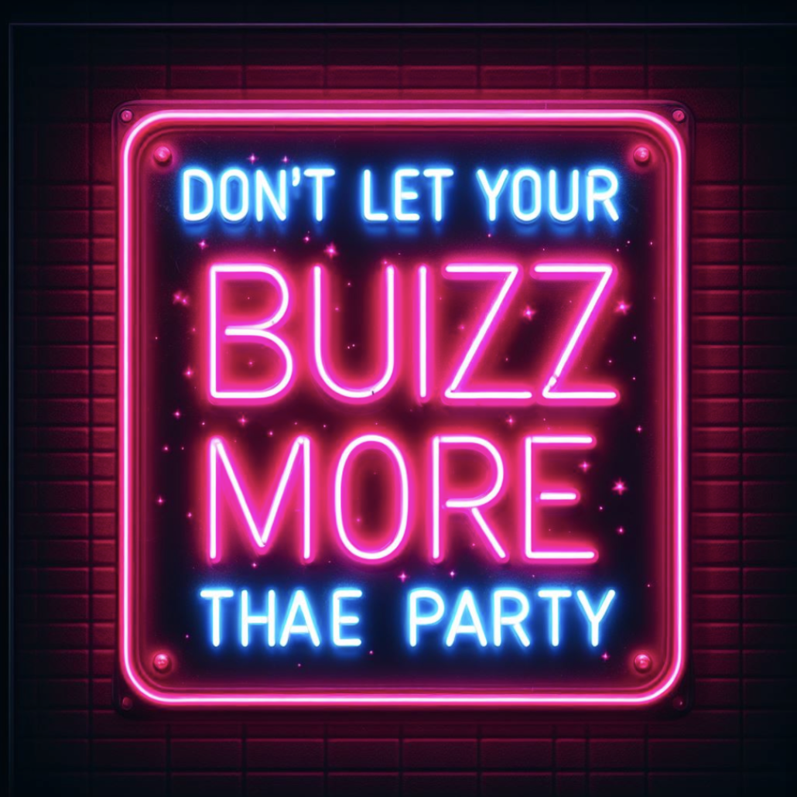
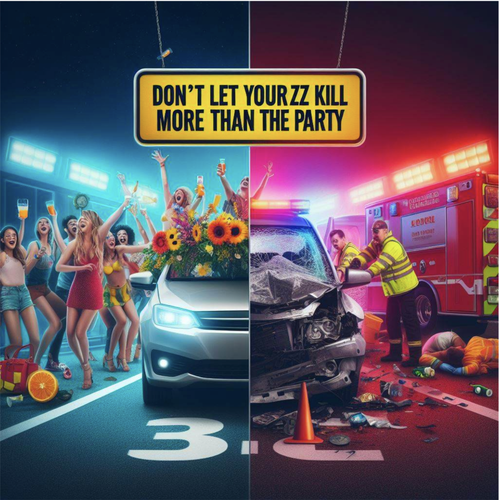
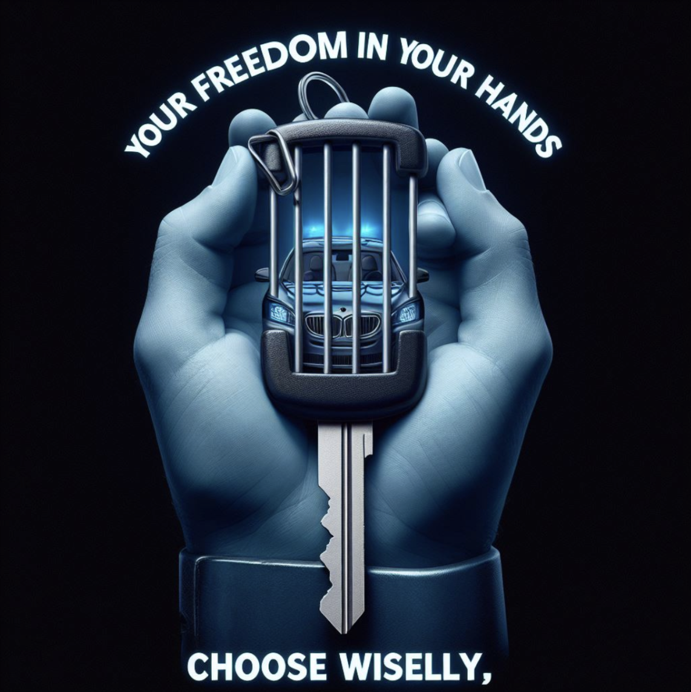
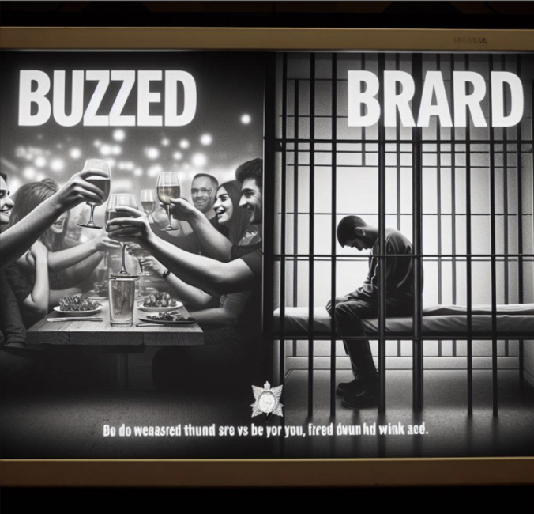

# Health Communication Campaign

### Kendall Allen and Emmy Keogh

### Overview

Welcome to our process of creating an anti-drunk-driving campaign completely through LLMs and AI-Generated images! Our goal is to raise awareness and promote responsible behavior behind the wheel by addressing both personal and social responsibility. We believe that every individual has a duty to themselves and others to avoid driving under the influence. Our two campaigns emphasize the consequences of drunk driving, for both the individual and for society as a whole. Through attention-grabbing slogans, powerful scripts, and compelling visual elements, we aim to encourage drivers to make the right choice and drive sober. Join us in spreading the message that responsible driving saves lives!

In this document, you will have access to both our Health Communication Campaign PDF and then the following evaluations. 

1. [Campaign development and images](COMM_Health_Campaign.pdf)
   - Describes the development process using LLM prompting for the two campaigns
3. [Campaign Evaluation using LLMs](Comm_Campaign_Evaluations.pdf)
   - Shows the evaluation of the campaigns using LLMs

### TLDR
* See below our final campaign images for the Individual Responsibility of a Drunk Driver versus the Social Responsibility of a Drunk Driver.

### Campaign Images

#### Social

#### Instagram

#### Infographic

### Individual

#### Instagram

#### Infographic

